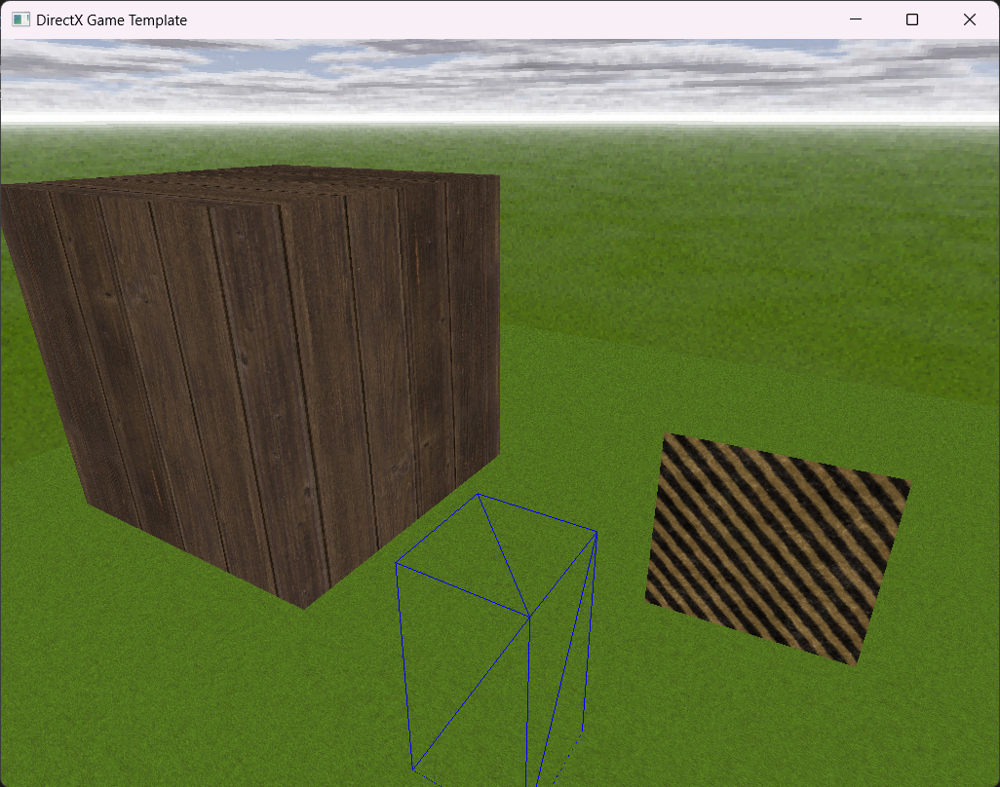

# DX11C - DirectX 11 Game Template using C

A DirectX 11 Template using C in Visual Studio 2022.

I made this project for learning Direct3D and the plan is to use this as a template for making 3d games using C instead of C++. A simple game with 3rd person camera that follows the player is what I had in mind. Also be able to pick up game objects from the ground in order to put it in the inventory. We also would need to implement a basic 3d collision check, i.e: if player is colliding against a wall so you prevent player to pass the wall, or if to trigger an area-trigger when a player steps into it. And we also need some basic 2d UI (HUD/Font/MouseCursor etc.). We also need to be able to play sounds and music files. Lastly we need to include an application icon and a shortcut icon for the 3d game template. We will see how far I will venture into this journey.

Key bindings:
- W: Move player forward
- S: Move player backward
- A: Straife player left
- D: Straife player right
- Q: Lower player camera (disabled)
- E: Raise player camrea (disabled)
- TAB: Switch between mouse look and mouse pointer mode
- ALT+ENTER: Switch between fullscreen and window mode
- ESC: Quit the game immediately (for debug)

NOTE: This is an experimental project so please remember this is not meant as production code.
